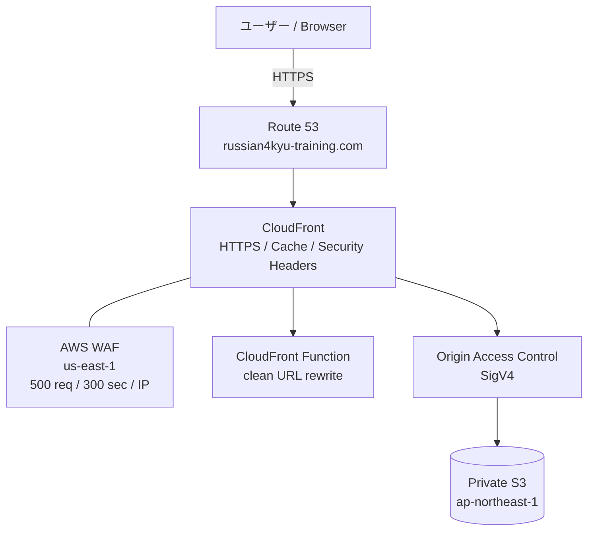
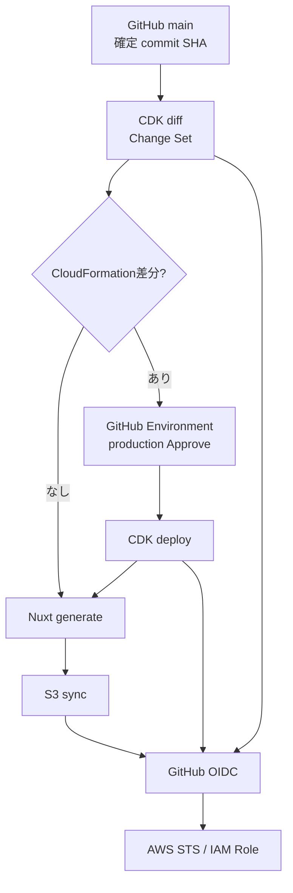
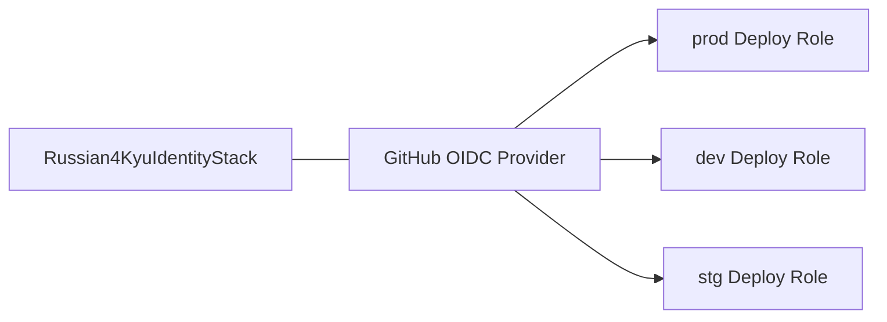
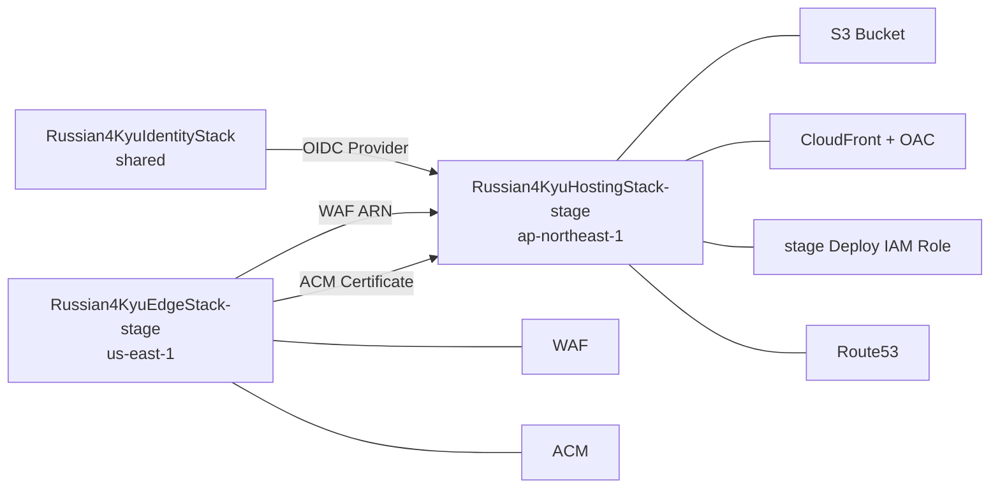

# 一般公開のためのコンポーネント構成図

ロシア語4級トレーニングを一般公開するためのAWS構成、環境分離、デプロイ経路、セキュリティ境界をまとめる。

本番の具体的な運用手順は [../DEPLOYMENT.md](../DEPLOYMENT.md) を参照する。

## 目的

- Nuxtで生成した静的サイトを安価かつ安全に一般公開する
- S3はpublicにせずCloudFront経由でのみ配信する
- CloudFront + AWS WAFでレート制限を行う
- GitHub Actionsには長期Access Keyを保存しない
- `main` の確定commitだけをproductionへデプロイする
- CloudFormation差分がある場合だけ人間のApproveを要求する
- `dev` / `stg` / `prod`を同じCDKコードから構築できるようにする
- productionドメイン `russian4kyu-training.com` で公開する

## 全体構成



S3 Website Hostingは使用せず、公開経路はCloudFrontに限定する。

## レンダリングとルーティング

`nuxt.config.ts` は `ssr: true` で、`pnpm generate` 時に主要ルートをprerenderする。

```text
Nuxt SSR enabled
  -> pnpm generate
  -> routeごとの静的HTML
  -> S3
  -> CloudFront
```

productionでは `NUXT_APP_BASE_URL=/` を指定する。

CloudFront Functionは `/verbs` などのclean URLをSSG済みのHTMLへrewriteする。SPAの `index.html` へ一律フォールバックする構成ではなく、検索エンジンやSNSクローラーにもprerender済みHTMLを返す。

GitHub Pages版ではリポジトリ配下で動かすため、base URLは `/russian-4kyu-training/` を使用する。

## CI/CD構成



`.github/workflows/deploy-aws.yml` は `main` pushと `workflow_dispatch` で起動する。すべてのjobは対象の `github.sha` をcheckoutする。

### 1. CDK diff

最初にChange Setベースで次を実行する。

```bash
pnpm exec cdk diff --all \
  --method=change-set \
  --fail \
  --no-color \
  -c stage=prod \
  -c domainName=russian4kyu-training.com \
  -c hostedZoneName=russian4kyu-training.com
```

結果はActions Job Summaryへ表示し、`cdk-diff.txt` artifactとしても保存する。

- 差分なし: application assetsのdeployへ進む
- 差分あり: `production` EnvironmentのApprove待ちへ進む
- diffコマンド失敗: deploy全体を停止する

エラーを「差分あり」と誤判定してApprove待ちへ進めない。

### 2. Infrastructure deploy

CloudFormation差分がある場合だけ `production` Environmentを使用する。Approve後、レビュー対象と同じcommit SHAのCDK定義をデプロイする。

```bash
pnpm exec cdk deploy Russian4KyuHostingStack-prod \
  --require-approval never \
  -c stage=prod \
  -c domainName=russian4kyu-training.com \
  -c hostedZoneName=russian4kyu-training.com
```

GitHub側のApproveが人間によるproduction変更承認を担うため、CDK CLI側のinteractive approvalは使わない。

### 3. Application deploy

infra deployが成功、または差分なしでskipされた場合に実行する。

1. `pnpm install --frozen-lockfile`
2. `NUXT_APP_BASE_URL=/` で `pnpm generate`
3. GitHub OIDCでproduction deploy roleをAssume
4. `.output/public` をproduction S3へsync

production workflowは `aws-production` concurrency groupを使い、新しい `main` runが始まった場合は古いpending runをキャンセルする。

## 環境分離

CDK contextの `stage` で環境を切り替える。

```text
-c stage=dev
-c stage=stg
-c stage=prod
```

未指定時は `prod`。

デフォルトのS3名:

```text
russian4kyu-training-dev-<AWS_ACCOUNT_ID>
russian4kyu-training-stg-<AWS_ACCOUNT_ID>
russian4kyu-training-prod-<AWS_ACCOUNT_ID>
```

productionは誤削除を避けるため `RemovalPolicy.RETAIN`。dev/stgは `RemovalPolicy.DESTROY` + `autoDeleteObjects: true` で使い捨て可能にする。

## リージョン

| コンポーネント | 配置 | 理由 |
|---|---|---|
| S3 | `ap-northeast-1` | 日本を主な利用地域とするため |
| CloudFront | Global | エッジ配信 |
| AWS WAF for CloudFront | `us-east-1` | CloudFrontスコープのWeb ACL要件 |
| ACM for CloudFront | `us-east-1` | CloudFront証明書の要件 |
| Route 53 | Global | DNS |
| IAM / GitHub OIDC | Global相当 | GitHub Actions認証 |

## S3

S3 bucketはCDKで作成・管理する。

- Block Public Access: ON
- S3 Website Hosting: 使用しない
- S3 managed encryption
- Bucket owner enforced
- `enforceSSL: true`
- CloudFront OACからの `GetObject` のみ許可
- production bucketは削除保護

S3 URLを直接開いてもコンテンツは取得できない。

## CloudFront / OAC

CloudFrontのS3 OriginにはOrigin Access Control（OAC）を利用する。

```text
Browser -> CloudFront -> OAC(SigV4) -> private S3
```

Bucket Policyでは対象CloudFront Distribution ARNからの `GetObject` のみ許可する。

## キャッシュ

| 対象 | Cache-Control | 方針 |
|---|---|---|
| `_nuxt/*` | `public,max-age=31536000,immutable` | ハッシュ付きファイルなので長期キャッシュ |
| HTML / manifest / icon等 | `no-cache` | 更新をすぐ確認できるよう再検証 |

通常deployでは毎回 `/*` invalidationせず、ハッシュ付きassetと再検証可能なHTMLを分けて扱う。

## WAF / DoS対策

CloudFrontにAWS WAF Web ACLを関連付ける。

```text
Aggregate key: IP
Evaluation window: 300 seconds
Limit: 500 requests
Action: BLOCK
```

CloudWatch Metrics / sampled requestsも有効にする。

## GitHub OIDC / IAM

GitHub OIDC ProviderはAWS account内で共有し、`Russian4KyuIdentityStack` でstage非依存に管理する。



GitHub ActionsにAWS Access Key / Secret Access Keyは保存しない。

production roleは用途を分けてOIDC subjectを制限する。

- `main` branch subject: CDK diffと自動S3 deploy
- `production` environment subject: Approve後のinfra deploy

GitHub Actions Variablesには次だけを登録する。

- `AWS_DEPLOY_ROLE_ARN`
- `AWS_BUCKET_NAME`

これらはARN・bucket名であり秘密鍵ではない。AWSへの認証自体はOIDC tokenとIAM Trust Policyで行う。

## カスタムドメイン

productionドメイン:

```text
russian4kyu-training.com
```

ドメインはRoute 53で登録する。Public Hosted Zoneを前提に、CDKがACM証明書、DNS validation、Route 53 A/AAAA Aliasを構築する。

## CDK Stack



## IaCの責務

### CDKで管理

- stage別S3 Bucket
- S3 Bucket Policy
- CloudFront Distribution / OAC
- CloudFront Function
- stage別AWS WAF Web ACL / rate-based rule
- shared GitHub OIDC Provider
- stage別GitHub Actions deploy IAM Role
- ACM Certificate
- Route 53 A / AAAA Alias

### 手動で管理

- Route 53でのドメイン購入
- CDK bootstrap（account / regionごとに初回のみ）
- 初回CDK deployとOIDC migration
- GitHub Actions Variablesの登録
- GitHub `production` Environmentのrequired reviewer設定

## 初回デプロイフロー

1. AWS CLI認証を確認
2. `us-east-1` / `ap-northeast-1` をCDK bootstrap
3. `cdk synth`
4. `cdk diff`
5. `cdk deploy --all`
6. CDKがprivate S3 / WAF / CloudFront / OAC / IAM / ACM / Route 53を構築
7. `.output/public` をproduction S3へ初回配置
8. production URLで表示確認
9. CDK OutputのRole ARN / Bucket名をGitHub Actions Variablesへ登録
10. `production` Environmentにrequired reviewerを設定

## 通常運用

```text
main merge
  -> CDK diff
  -> 差分なし -----------------------> Nuxt generate -> S3 sync
  -> CloudFormation差分あり
       -> production Approve
       -> CDK deploy
       -> Nuxt generate
       -> S3 sync
```

アプリコードだけの変更ではApproveを要求せず、CloudFormation stackに変更がある場合だけ承認する。

## GitHub Pagesとの移行

AWS本番は稼働済みだが、GitHub Pages workflowは当面フォールバックとして残している。

- GitHub Pages: `baseURL=/russian-4kyu-training/`
- AWS: `NUXT_APP_BASE_URL=/`

GitHub Pages廃止とrepository Private化は別Issueで管理する。
