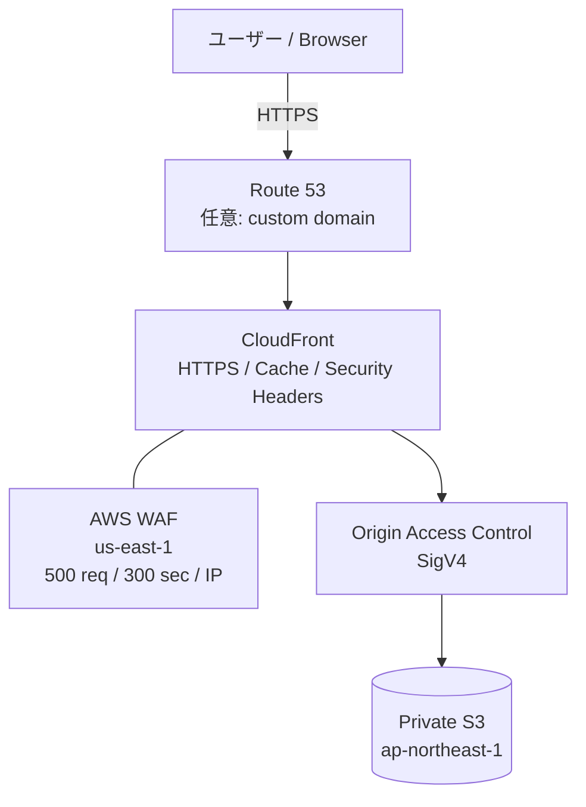
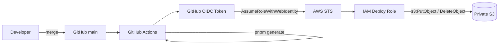
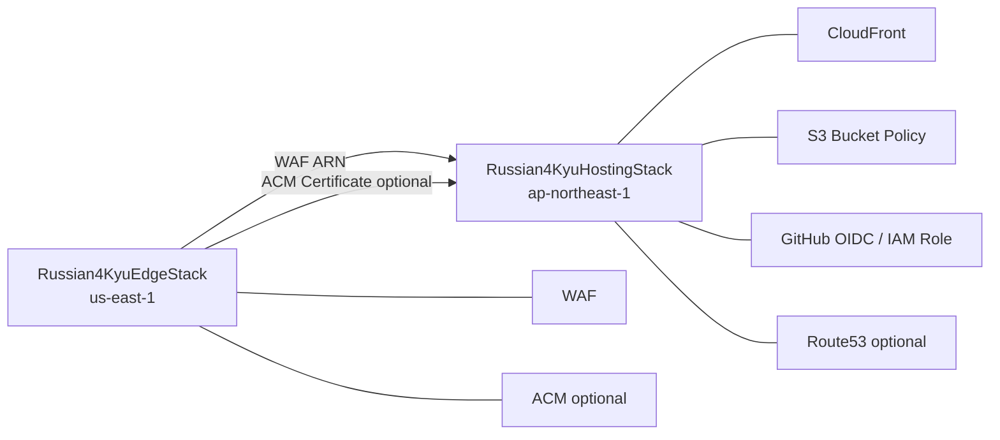

# 一般公開のためのコンポーネント構成図

ロシア語4級トレーニングを一般公開するためのAWS構成と、デプロイ経路・セキュリティ境界をまとめる。

## 目的

- Nuxtで生成した静的サイトを安価かつ安全に一般公開する
- S3はpublicにせず、CloudFront経由でのみ配信する
- DoS/DDoSに対してCloudFront + AWS WAFのエッジ側で防御する
- GitHub Actionsには長期Access Keyを保存しない
- `main`へのマージを本番デプロイのトリガーにする
- 将来カスタムドメイン`russian4kyu-training.jp`へ切り替えられる構成にする

## 全体構成



カスタムドメイン導入前はRoute 53を経由せず、CloudFrontが払い出す`*.cloudfront.net`で動作確認できる。

## CI/CD構成



GitHub ActionsにAWS Access Key / Secret Access Keyは保存しない。

## リージョン

| コンポーネント | 配置 | 理由 |
|---|---|---|
| S3 | `ap-northeast-1` | 日本を主な利用地域とするため |
| CloudFront | Global | エッジ配信 |
| AWS WAF for CloudFront | `us-east-1` | CloudFrontスコープのWeb ACL要件 |
| ACM for CloudFront | `us-east-1` | CloudFront証明書の要件 |
| Route 53 | Global | DNS |
| IAM / GitHub OIDC | Global相当 | GitHub Actions認証 |

## S3

本番バケットは既に手動作成済みで、CDKでは名前を指定して既存バケットを参照する。

デフォルト:

```text
russian4kyu-training-prod-<AWS_ACCOUNT_ID>
```

現環境:

```text
russian4kyu-training-prod-470529257240
```

### 方針

- Block Public Access: ON
- Webサイトホスティング機能: 使用しない
- オブジェクトの一般公開: しない
- CloudFront OACからの`GetObject`のみBucket Policyで許可
- `aws:SecureTransport=false`は明示的に拒否

S3 URLを直接開いてもコンテンツは取得できず、公開経路はCloudFrontに限定する。

## CloudFront / OAC

CloudFrontのS3 OriginにはOrigin Access Control（OAC）を利用する。

```text
Browser -> CloudFront -> OAC(SigV4) -> private S3
```

OACを使うことでS3をpublicにする必要がなく、Bucket Policyは対象CloudFront Distribution ARNに限定できる。

### SPA routing

Nuxtは`ssr: false`のSPAとして生成するため、CloudFrontの403/404は`/index.html`を200で返す。これによりVue RouterのURLへ直接アクセスしてもアプリを起動できる。

## キャッシュ

| 対象 | Cache-Control | 方針 |
|---|---|---|
| `_nuxt/*` | `public,max-age=31536000,immutable` | ハッシュ付きファイルなので長期キャッシュ |
| HTML / manifest / icon等 | `no-cache` | 更新をすぐ確認できるよう再検証 |

CloudFront側はoriginのCache-Controlを尊重する。通常デプロイで毎回`/*` invalidationする構成にはしない。

## WAF / DoS対策

CloudFrontにAWS WAF Web ACLを関連付ける。

初期ルール:

```text
Aggregate key: IP
Evaluation window: 300 seconds
Limit: 500 requests
Action: BLOCK
```

静的学習サイトとしては通常利用で到達しにくい値から開始し、CloudWatch Metrics / WAF sampled requestsを見て調整する。

CloudFrontを入口にすることでオリジンS3を直接インターネット公開せず、エッジ側でトラフィックを処理する。

## GitHub OIDC / IAM

`main`へのpushでのみ本番用IAM RoleをAssumeできるようTrust Policyを限定する。

このRepositoryは2026-07-15以降に作成されているため、GitHubのimmutable OIDC subject形式を利用する。

```text
repo:toshiakisan1127@48203235/russian-4kyu-training@1355052125:ref:refs/heads/main
```

Roleには本番S3へのデプロイに必要な権限だけを付与する。

主な権限:

- `s3:ListBucket`
- `s3:GetObject`
- `s3:PutObject`
- `s3:DeleteObject`

## カスタムドメイン

予定ドメイン:

```text
russian4kyu-training.jp
```

ドメイン登録そのものはRoute 53コンソールで行う。Hosted Zone作成後はCDKで以下を構築する。

```text
Route 53 A / AAAA Alias
        ↓
CloudFront
        ↑
ACM Certificate (us-east-1)
```

ACMのDNS validationもRoute 53を利用する。

## IaCの責務

### CDKで管理

- CloudFront Distribution
- CloudFront OAC
- S3 Bucket Policy
- AWS WAF Web ACL / rate-based rule
- GitHub OIDC Provider
- GitHub Actions deploy IAM Role
- ACM Certificate（カスタムドメイン利用時）
- Route 53 A / AAAA Alias（カスタムドメイン利用時）

### 手動で管理

- Route 53でのドメイン購入
- 初回のproduction S3 bucket作成
- S3 Block Public Accessの有効化
- CDK bootstrap（AWS account / regionごとに初回のみ）
- 初回CDK deploy
- GitHub Actions Variablesの登録

## CDK Stack



リージョンの異なるCloudFront用WAF/ACMを`EdgeStack`に分離し、S3/CloudFront/IAMを`HostingStack`で管理する。

## デプロイフロー

### 初回

1. private S3 bucketを作成し、静的ファイルを配置
2. AWS CLIの認証を確認
3. `us-east-1` / `ap-northeast-1`を`cdk bootstrap`
4. `cdk synth`
5. `cdk diff`
6. `cdk deploy --all`
7. CloudFront URLで表示確認
8. CDK OutputのRole ARN / Bucket名をGitHub Actions Variablesへ登録
9. PRを`main`へマージ

### 通常運用

```text
main merge
  -> GitHub Actions
  -> Nuxt generate (baseURL=/)
  -> GitHub OIDC
  -> IAM Role Assume
  -> S3 sync
  -> CloudFrontから新しいコンテンツを配信
```

## GitHub Pagesとの移行

移行確認が完了するまでは既存GitHub Pages workflowも残す。

- GitHub Pages: `baseURL=/russian-4kyu-training/`
- AWS: `NUXT_APP_BASE_URL=/`

AWS公開が安定した後にGitHub Pages workflowを削除する。

## 今後

1. CDKを初回deployしてCloudFront URLで表示確認
2. GitHub OIDC経由の`main`自動デプロイを確認
3. `russian4kyu-training.jp`を取得
4. ACM + Route 53 Aliasを追加
5. WAF metricsを確認してrate limitを調整
6. GitHub Pagesを停止
