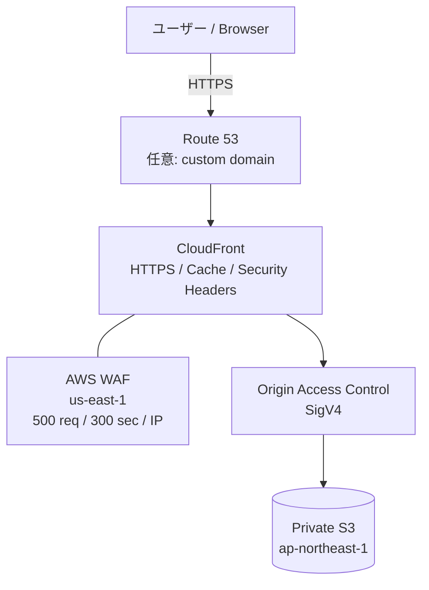
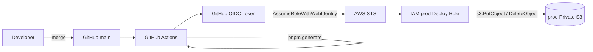
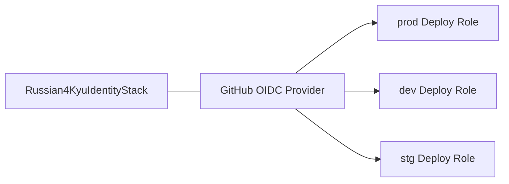
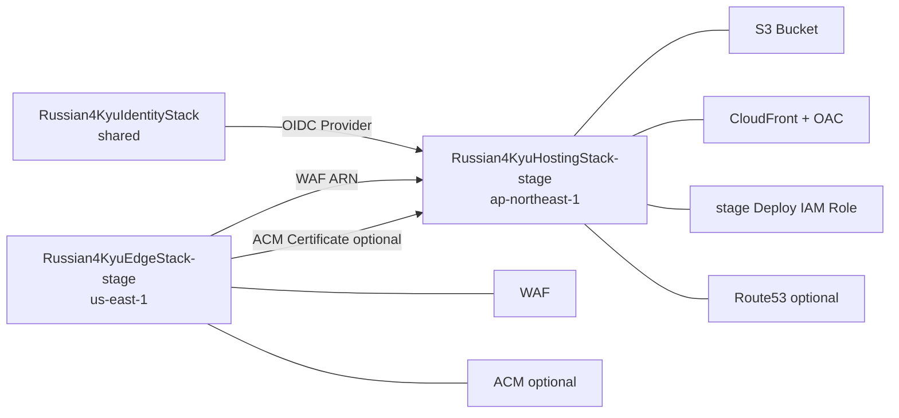

# 一般公開のためのコンポーネント構成図

ロシア語4級トレーニングを一般公開するためのAWS構成、環境分離、デプロイ経路、セキュリティ境界をまとめる。

## 目的

- Nuxtで生成した静的サイトを安価かつ安全に一般公開する
- S3はpublicにせずCloudFront経由でのみ配信する
- DoS/DDoSに対してCloudFront + AWS WAFで防御する
- GitHub Actionsには長期Access Keyを保存しない
- `main`へのマージをproductionデプロイのトリガーにする
- `dev` / `stg` / `prod`を同じCDKコードから構築できるようにする
- 将来`russian4kyu-training.jp`へ切り替えられる構成にする

## 全体構成



カスタムドメイン導入前はRoute 53を経由せず、CloudFrontの`*.cloudfront.net`で動作確認する。

## CI/CD構成



GitHub ActionsにAWS Access Key / Secret Access Keyは保存しない。

## 環境分離

CDK contextの`stage`で環境を切り替える。

```text
-c stage=dev
-c stage=stg
-c stage=prod
```

未指定時は`prod`。

デフォルトのS3名:

```text
russian4kyu-training-dev-<AWS_ACCOUNT_ID>
russian4kyu-training-stg-<AWS_ACCOUNT_ID>
russian4kyu-training-prod-<AWS_ACCOUNT_ID>
```

productionは誤削除を避けるため`RemovalPolicy.RETAIN`。dev/stgは`RemovalPolicy.DESTROY`と`autoDeleteObjects: true`で使い捨て可能にする。

## リージョン

| コンポーネント | 配置 | 理由 |
|---|---|---|
| S3 | `ap-northeast-1` | 日本を主な利用地域とするため |
| CloudFront | Global | エッジ配信 |
| AWS WAF for CloudFront | `us-east-1` | CloudFrontスコープのWeb ACL要件 |
| ACM for CloudFront | `us-east-1` | CloudFront証明書の要件 |
| Route 53 | Global | DNS |
| IAM / GitHub OIDC | Global相当 | GitHub Actions認証 |

## S3

S3 bucket自体をCDKで作成・管理する。

### 方針

- Block Public Access: ON
- S3 Website Hosting: 使用しない
- S3 managed encryption
- Bucket owner enforced
- `enforceSSL: true`
- CloudFront OACからの`GetObject`のみ許可
- production bucketは削除保護

S3 URLを直接開いてもコンテンツは取得できず、公開経路はCloudFrontに限定する。

## CloudFront / OAC

CloudFrontのS3 OriginにはOrigin Access Control（OAC）を利用する。

```text
Browser -> CloudFront -> OAC(SigV4) -> private S3
```

Bucket Policyでは対象CloudFront Distribution ARNからの`GetObject`のみ許可する。

### SPA routing

Nuxtは`ssr: false`のSPAとして生成するため、CloudFrontの403/404は`/index.html`を200で返す。Vue RouterのURLへ直接アクセスしてもアプリを起動できる。

## キャッシュ

| 対象 | Cache-Control | 方針 |
|---|---|---|
| `_nuxt/*` | `public,max-age=31536000,immutable` | ハッシュ付きファイルなので長期キャッシュ |
| HTML / manifest / icon等 | `no-cache` | 更新をすぐ確認できるよう再検証 |

通常デプロイで毎回`/*` invalidationする構成にはしない。

## WAF / DoS対策

CloudFrontにAWS WAF Web ACLを関連付ける。

```text
Aggregate key: IP
Evaluation window: 300 seconds
Limit: 500 requests
Action: BLOCK
```

環境ごとにWeb ACLを分け、CloudWatch Metrics / sampled requestsもstage名付きで分離する。

## GitHub OIDC / IAM

GitHub OIDC ProviderはAWS account内で共有するため、`Russian4KyuIdentityStack`としてstage非依存に分離する。



`main`へのpushでproduction IAM RoleをAssumeできるようTrust Policyを限定する。

```text
repo:toshiakisan1127@48203235/russian-4kyu-training@1355052125:ref:refs/heads/main
```

production Actionsではproduction S3へのデプロイに必要な権限だけを付与する。

## カスタムドメイン

予定ドメイン:

```text
russian4kyu-training.jp
```

ドメイン購入はRoute 53コンソールで行う。Hosted Zone作成後はCDKがACM証明書、DNS validation、Route 53 A/AAAA Aliasを構築する。

## CDK Stack



## IaCの責務

### CDKで管理

- stage別S3 Bucket
- S3 Bucket Policy
- CloudFront Distribution / OAC
- stage別AWS WAF Web ACL / rate-based rule
- shared GitHub OIDC Provider
- stage別GitHub Actions deploy IAM Role
- ACM Certificate（カスタムドメイン利用時）
- Route 53 A / AAAA Alias（カスタムドメイン利用時）

### 手動で管理

- Route 53でのドメイン購入
- CDK bootstrap（account / regionごとに初回のみ）
- 初回CDK deploy
- GitHub Actions Variablesの登録

## 初回デプロイフロー

1. AWS CLI認証を確認
2. `us-east-1` / `ap-northeast-1`を`cdk bootstrap`
3. `cdk synth`
4. `cdk diff`
5. `cdk deploy --all`（stage未指定ならprod）
6. CDKがprivate S3 / WAF / CloudFront / OAC / IAMを作成
7. `pnpm generate`した`.output/public`をproduction S3へ初回配置
8. CloudFront URLで表示確認
9. CDK OutputのRole ARN / Bucket名をGitHub Actions Variablesへ登録
10. PRを`main`へマージ

## 通常運用

```text
main merge
  -> GitHub Actions
  -> Nuxt generate (baseURL=/)
  -> GitHub OIDC
  -> prod IAM Role Assume
  -> prod S3 sync
  -> CloudFrontから新しいコンテンツを配信
```

## GitHub Pagesとの移行

移行確認が完了するまでは既存GitHub Pages workflowも残す。

- GitHub Pages: `baseURL=/russian-4kyu-training/`
- AWS: `NUXT_APP_BASE_URL=/`

AWS公開が安定した後にGitHub Pages workflowを削除する。
